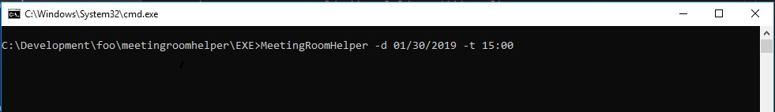
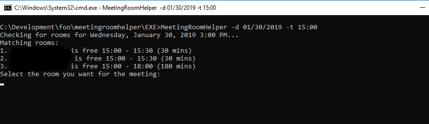
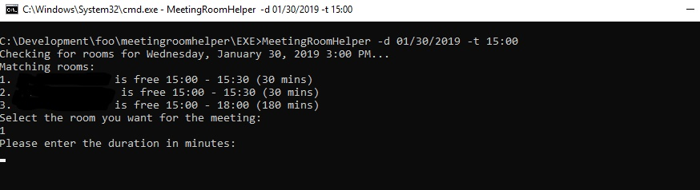
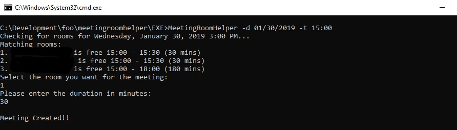
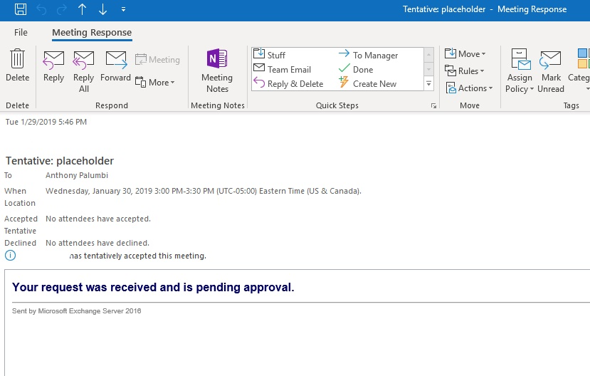

## About

Solves the problem of not know what conference rooms are available for a certain day/time.

## Usage

`MEETINGROOMHELPER [/T hh:mm] [/D mo/dd/yyyy]`
* /T    The Time of the potential meeting. Format 16:30.  Defaults to now  
* /D    The Date of the potential meeting. Format 12/01/2016.  Defaults to today  

## Flow

* With outlook running...Execute the app using the command above  

* See the list of rooms that fit  
 

* Select the room by number (gets copied to clipboard for use in an   invite)  

* Add a duration in minutes  

* Meeting gets scheduled with "placeholder" as subject  

